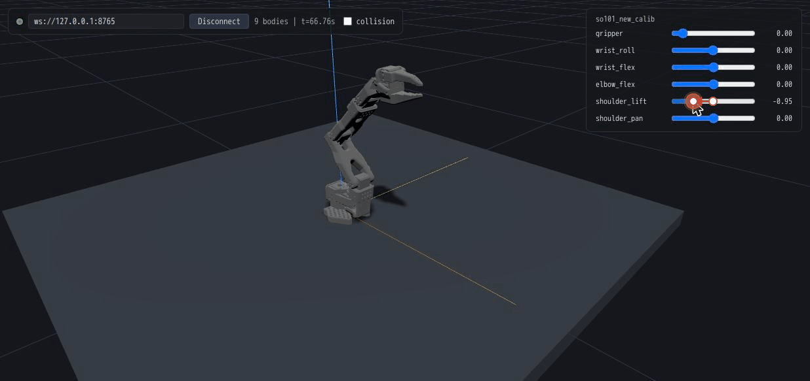

# robox3d(日本語）

**ブラウザがビューアになる、軽量ロボットシミュレーション。**

robox3d は [Box3D](https://github.com/erincatto/box3d)(Box2D の作者 Erin Catto
による新しい3D物理エンジン)をロボティクス向けにパッケージ化した Python
ライブラリです。URDF 読み込み、位置・トルク制御、F/T・IMU・LiDAR・接触
センサー、そして WebSocket 経由の React Three Fiber ビューアを備えます。
物理はヘッドレスで動き、可視化はブラウザのタブ1枚です。



```bash
pip install "robox3d[viz]"
python -m robox3d.demo so101   # SO-ARM101 + 関節スライダー → http://localhost:8765
```

最新のドキュメントは英語版 [README.md](README.md) を参照してください。
以下は要点の日本語まとめです。

## 特徴

- **ブラウザネイティブ可視化** — OpenGL ウィンドウ不要。シムが自分でビューアを
  HTTP 配信(WebSocket と同一ポート)。サーバーでヘッドレス実行して手元の
  ブラウザから観察・操作できます。`robot=` を渡すと関節スライダーが出ます
- **導入が軽い** — 依存なしの小さな C17 エンジンをプリビルド wheel で配布。
- **URDF 対応** — リンク・ジョイント・慣性・コリジョン(凸包 / CoACD 凸分解)・
  visual メッシュと色を自動変換
- **制御とセンサー** — 物理単位ゲイン(kp [N·m/rad]、DC剛性較正済み)の
  バネ位置制御、擬似トルク制御、重力補償FF、F/T・IMU・LiDAR・接触センサー
- **決定論的で高速** — スレッド数によらずビット一致(検証済み)。6軸アーム+
  位置制御で約44,000 steps/s(実時間比約180倍、240Hz×4substeps、
  デスクトップCPU 1コア、毎ステップの目標書き込み込み)
- **録画・リプレイ** — 配信と同一フォーマットの `.rbx` をそのままビューアで再生

## 開発セットアップ

```bash
git clone --recursive https://github.com/neka-nat/robox3d
cd robox3d
uv sync                                # box3d + シムをビルド
uv run pytest                          # テスト(56件)
uv run python tools/build_viewer.py    # ビューアを同梱ビルド(要 pnpm)
uv run python examples/viz_arm.py
```

examples はすべてデフォルトでビューアを配信し、Ctrl+C するまで動き続けます
(振り子はターゲットスイープ、箱は再落下など)。`--headless` を付けると
ビューアなしの高速数値実行になります。

- 構想: [concept.md](concept.md)
- 開発計画: [docs/development-plan.md](docs/development-plan.md)
- Box3D採用判定の検証レポート: [docs/validation-report.md](docs/validation-report.md)

## 制約(正直に)

- Box3D は最大座標系(ゲーム物理系)。接触の多いシーンが得意分野で、
  精密な動力学検証は Pinocchio / MuJoCo との突き合わせを推奨
- リボリュートの物理リミットはエンジン制約で ±0.99π まで(超過分は指令クランプ)
- `substeps < 4` は不可(発散するため)
- 平行ヒンジが垂直ヒンジに挟まれたチェーン(一般的なアーム構成)では、エンジンの
  軸整列拘束がヒンジ軸へ微小トルクを漏らす。位置制御のデフォルト設定で約3°以内に
  抑えており、`enable_position_control(constraint_hertz=...)` で精度とピボット剛性を
  トレードできる(詳細: [docs/spring-chain-investigation.md](docs/spring-chain-investigation.md))

## ライセンス

MIT。同梱の SO-ARM101 モデルは TheRobotStudio(Apache-2.0)、
Box3D は Erin Catto(MIT)。
