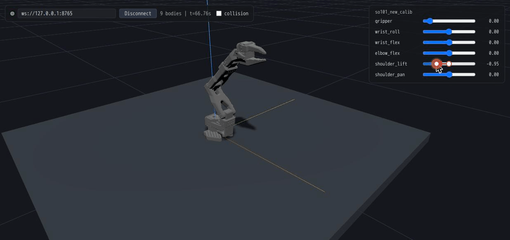

# robox3d(日本語）

**ブラウザがビューアになる、軽量ロボットシミュレーション。**

robox3d は [Box3D](https://github.com/erincatto/box3d)(Box2D の作者 Erin Catto
による新しい3D物理エンジン)をロボティクス向けにパッケージ化した Python
ライブラリです。URDF 読み込み、位置・トルク制御、F/T・IMU・LiDAR・接触
センサー、そして WebSocket 経由の React Three Fiber ビューアを備えます。
物理はヘッドレスで動き、可視化はブラウザのタブ1枚です。



```bash
pip install "robox3d[viz]"
python -m robox3d.demo so101   # SO-ARM101 + 関節スライダー → http://localhost:8765
```

最新のドキュメントは英語版 [README.md](README.md) を参照してください。
以下は要点の日本語まとめです。

## 特徴

- **ブラウザネイティブ可視化** — OpenGL ウィンドウ不要。シムが自分でビューアを
  HTTP 配信(WebSocket と同一ポート)。サーバーでヘッドレス実行して手元の
  ブラウザから観察・操作できます。`robot=` を渡すと関節スライダーが出ます
- **導入が軽い** — 依存なしの小さな C17 エンジンをプリビルド wheel で配布。
- **URDF 対応** — リンク・ジョイント・慣性・コリジョン(凸包 / CoACD 凸分解)・
  visual メッシュと色を自動変換
- **制御とセンサー** — 物理単位ゲイン(kp [N·m/rad]、DC剛性較正済み)の
  バネ位置制御、擬似トルク制御、重力補償FF、F/T・IMU・LiDAR・接触センサー
- **ネイティブ実行とバッチAPI** — 物理計算はCで実行し、ボディの姿勢取得や
  関節の目標更新をPythonからまとめて呼び出せます
- **録画・リプレイ** — 配信と同一フォーマットの `.rbx` をそのままビューアで再生

## 開発セットアップ

```bash
git clone --recursive https://github.com/neka-nat/robox3d
cd robox3d
uv sync                                # box3d + シムをビルド
uv run pytest                          # テスト
uv run python tools/build_viewer.py    # ビューアを同梱ビルド(要 pnpm)
uv run python examples/viz_arm.py
```

examples はすべてデフォルトでビューアを配信し、Ctrl+C するまで動き続けます
(振り子はターゲットスイープ、箱は再落下など)。`--headless` を付けると
ビューアなしの高速数値実行になります。

[ドキュメント一覧](docs/README.md)と[開発ガイド](docs/development.md)に、
ビルドの前提条件、ビューア開発、ソース構成をまとめています(英語)。

## 制約

- Box3D は最大座標系の剛体エンジンです。追従精度と安定性はモデル、荷重、
  時間刻み、拘束の設定に依存するため、利用する条件で確認してください
- リボリュートの物理リミットはエンジン制約で ±0.99π まで(超過分は指令クランプ)
- サブステップ数は4以上を使用してください。`World(substeps=...)` に4未満を
  指定すると `UnstableSimulationWarning` が出ます
- 平行ヒンジが垂直ヒンジに挟まれたチェーン(一般的なアーム構成)では、エンジンの
  軸整列拘束がヒンジ軸へ微小トルクを漏らします。
  `enable_position_control(constraint_hertz=...)` で追従精度とピボット剛性を
  調整できます(既定値は60 Hz)
- バネによる位置制御はURDFのeffortリミットを強制しません
- 決定論の回帰テストは同条件の再実行と一部のスレッド数を対象としており、
  すべてのプラットフォームやシーンでのビット一致を保証するものではありません

詳しくは[制約と制御の調整ガイド](docs/limitations.md)を参照してください(英語)。

## ライセンス

MIT。同梱の SO-ARM101 モデルは TheRobotStudio(Apache-2.0)、
Box3D は Erin Catto(MIT)。
